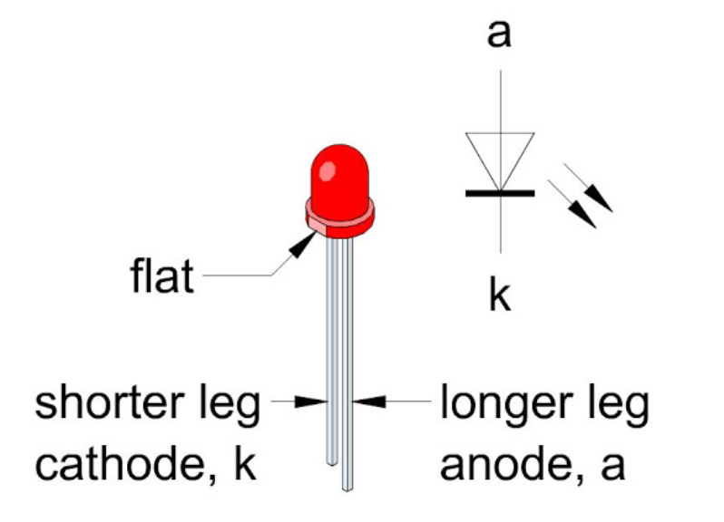
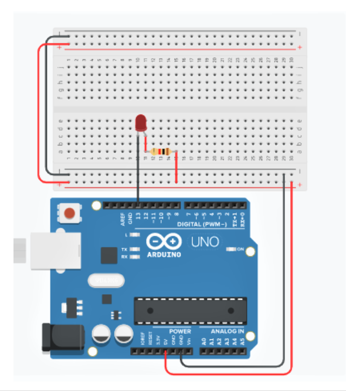
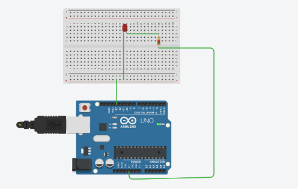

<h4>  Project description <h4>

Led blinking is the most beginner & easy step to start your experiment with arduino. Lets get started

Firstly identify anode(+ve) & cathode (-ve) leg of LED. Following diagram gives a clear idea of LED

 <!--  -->
 

Now connect a resistor to positive leg and other end of resistor to 5V.Cathode will be connected to Arduino GPIO, in our case pin 13.Final circuit will look as :

 <!--  -->
 

   

 <!--  -->
 
