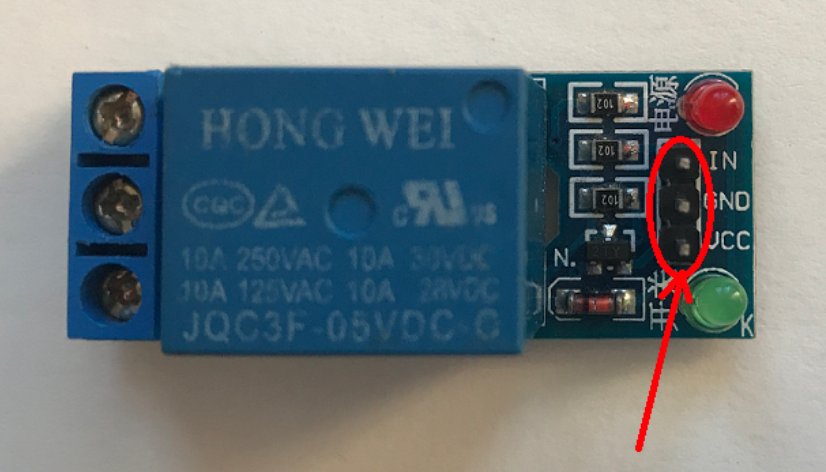
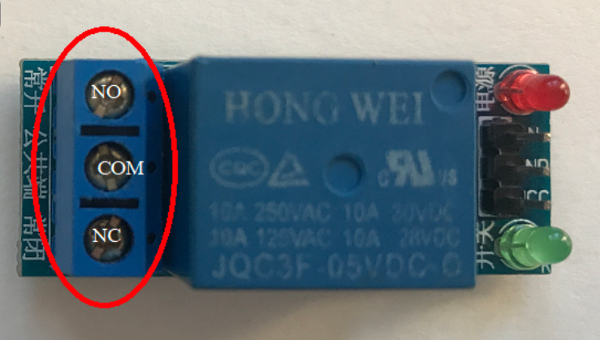
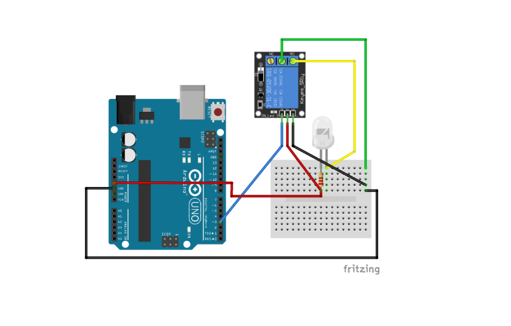

Project description

Connections
1). Relay to Arduino Connection

Connect the Vcc pin of Relay to Arduino 5V
Connect the GND pin of Relay to Arduino GND
Connect the IN pin(Input pin) of Relay to Arduino digital pin D3

2). Relay to LED connection
The relay module has 3pin screw terminal.
a). NO - Normally open
b). COM - Common
c). NC - Normally closed

High voltage connections can be made to this screw terminal. For example: Bulb, ceiling fan etc., But in this project we are just using an LED.

When you make the connection between a) and b), the connected LED is always ON until it receives a signal from the Arduino to turn it OFF.

When you make the connection between b) and c), the connected LED is OFF until it receives a signal from the Arduino to turn it ON.

I have used breadboard to make connections easier. See the circuit diagram to understand better!

<--------Relay Arduino-------->

