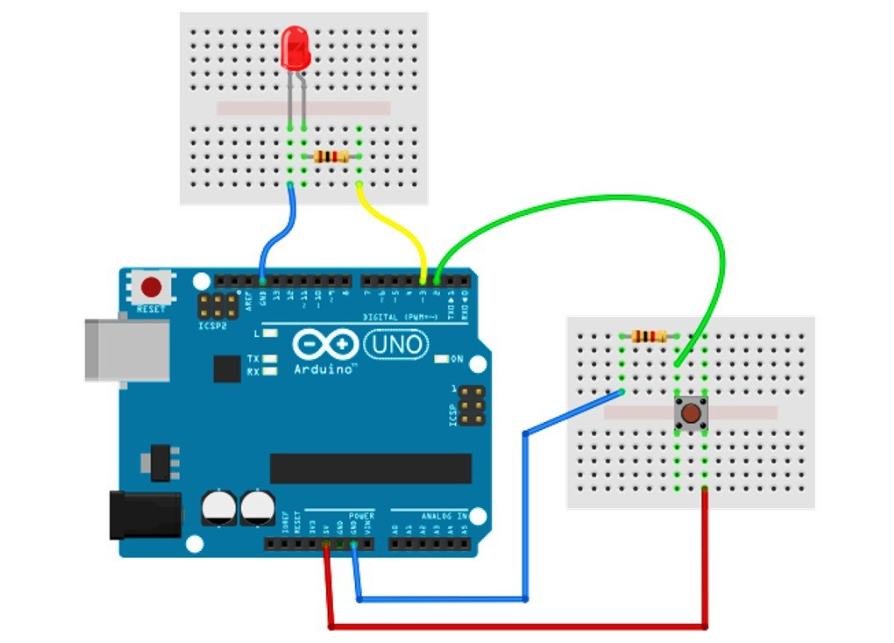

<h4> Project description <h4>

This project demonstrates the use of a push button to operate a LED.

 <!--  -->
  

Objective:

To Set LED ON when Button is pressed.
To Set LED OFF when Button is pressed (the opposite effect).
