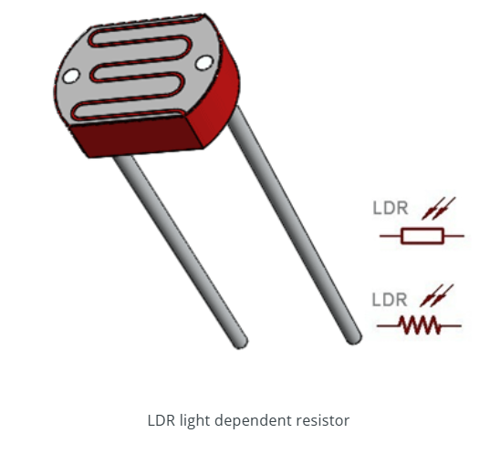
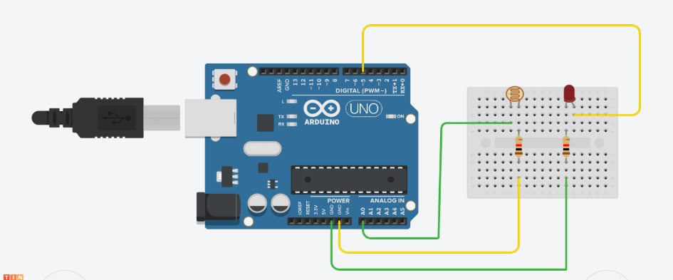

Project Description:
This project demonstrates how to interface an LDR (Light Dependent Resistor) with an Arduino Uno to detect light intensity. An LED is used as output, which turns ON in darkness and OFF when there's sufficient light, simulating an automatic lighting system.

<!--  -->

Working Principle:
The LDR's resistance increases in darkness and decreases in light. Arduino reads this change through analog pin A0 and controls the LED accordingly via digital pin 5.

Component Summary:

LDR: Senses light; one terminal to A0, the other to ground via a resistor.

Arduino Uno: ATmega328-based microcontroller for reading sensor input and controlling output.

LED: Emits light; positive pin to D5, negative through a resistor to GND.

This simple project highlights basic sensor interfacing and conditional output control using Arduino.

<!--  -->

