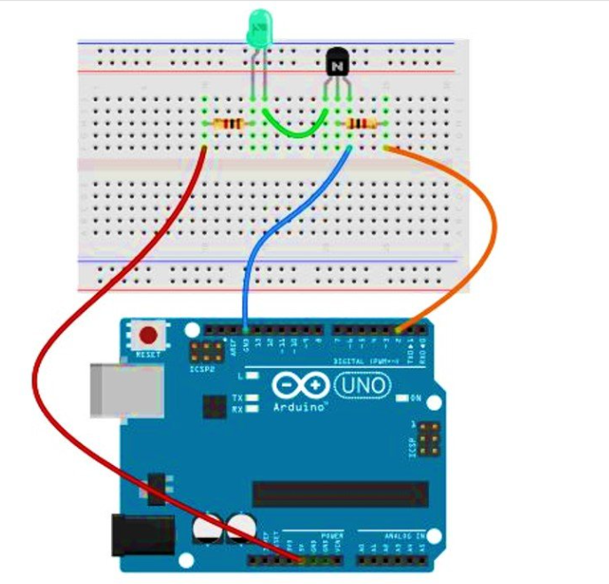

Objective:

To demonstrate how a transistor can be used as an electronic switch to control the operation of a load (like an LED or motor).

---

Components Required:

- NPN Transistor (e.g., BC547 or 2N2222)
- Resistor (e.g., 1kΩ for base)
- LED (or any load like a motor)
- Power supply (e.g., 9V battery)
- Breadboard and connecting wires
- Push button (optional for manual control)

---

<!--  -->

Working Principle:

A **transistor acts like a switch** that is controlled by a small current at the **base** terminal.
When a small current flows into the base, it allows a larger current to flow from **collector to emitter**, turning **ON** the connected load (like LED).
When the base current is removed, the transistor turns **OFF**, and so does the load.

---

Circuit Description:

1. The **base** of the transistor is connected to a resistor, then to a switch or input signal.
2. The **collector** is connected to one end of the load (e.g., LED), and the other end of the load goes to the **positive terminal** of the battery.
3. The **emitter** is connected to the **ground** (negative terminal of battery).
4. When the base is supplied with current, the transistor conducts and the load gets powered.

---

Applications:

- Automatic light/motor control systems
- Digital logic circuits
- Microcontroller-based switching
- Relay driver circuits

---
